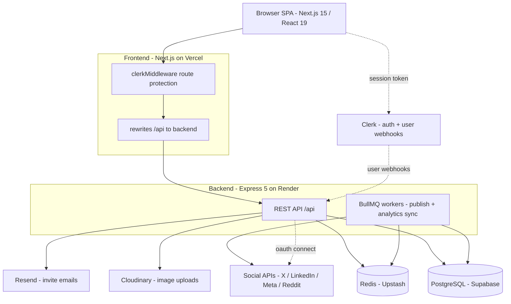
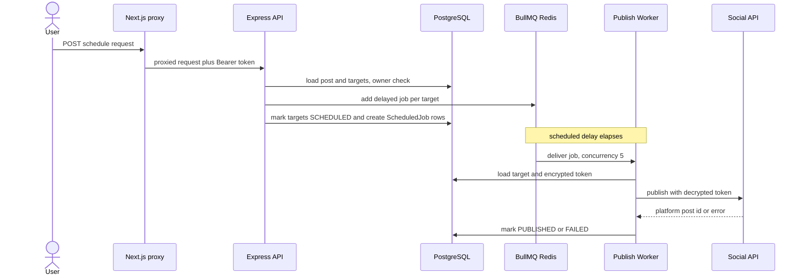
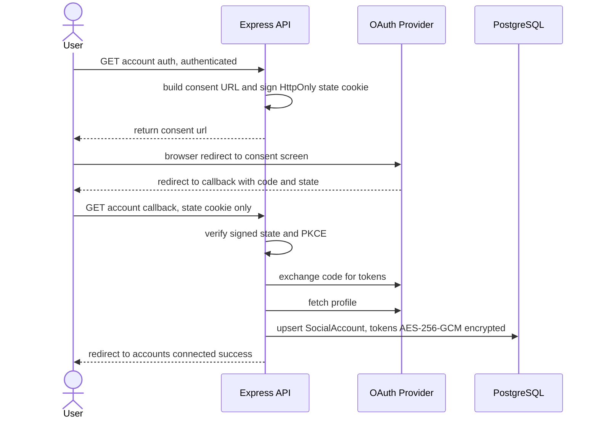

<p align="center">
  
</p>


<p align="center">Create, schedule, and publish content across your social accounts from one place</p>

## Core Features

- Write a post once and publish it to multiple platforms
- Schedule posts to go out at a set time using a background job queue
- Track engagement and reach in an analytics dashboard
- Connect and manage your social accounts in one view

## Tech Stack


## Architecture

PostPilot is a two-service app: a Next.js frontend and an Express API, backed by
PostgreSQL and Redis. The frontend reverse-proxies `/api/*` to the backend
(`frontend/next.config.ts`) so the browser, the Clerk session, and the OAuth
state cookie are all same-origin. Clerk handles authentication; a **Model B**
schema fans one `Post` out to one `PostTarget` per platform so each platform
publishes and fails independently. Scheduled publishing and periodic analytics
sync run on BullMQ workers hosted in the same backend process.

### System overview



### Scheduled publish flow



### OAuth account-connect flow



## Run with Docker

Runs the full stack locally: frontend, backend, Postgres, and Redis.

1. Fill in `backend/.env` and `frontend/.env` (see the matching `.env.example` files).
2. Copy `.env.example` to `.env` in the project root and set `NEXT_PUBLIC_CLERK_PUBLISHABLE_KEY` (the frontend build needs it).
3. Start everything:

   ```
   docker compose up --build
   ```

The frontend is at http://localhost:3000 and the backend at http://localhost:5000. The backend applies database migrations on start and runs the background job worker in the same container. Postgres and Redis data persist in named volumes.
